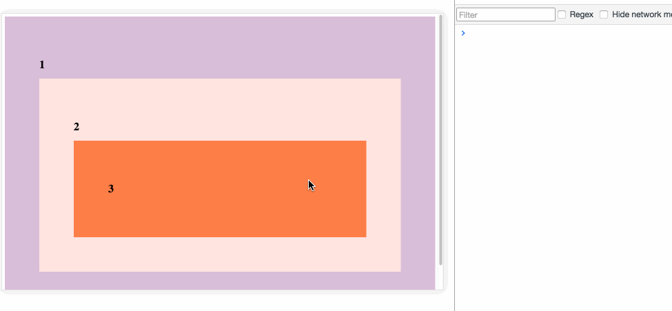
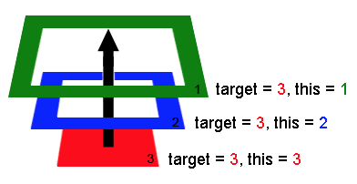

What is Event Delegation?
===
Event Delegation is a technique involving attaching event listeners to the parent instead of attaching to a child. It leverages the power of event-bubble-up mechanism.

Tgere are some of the common JavaScript events:
- change:: An HTML element has been changed
- click:: The user clicks an HTML element
- mouseover:: The user moves the mouse over an HTML element
- mouseout:: The user moves the mouse away from an HTML element
- keydown:: The user pushes a keyboard key
- load:: The browser has finished loading the page

Event Bubbling/Event Propagation
---
Whenever a user makes a click it ripples up all the way up to the top of the DOM and triggers clicks events on all the parent elements of the element you clicked



And here is how the click event bubbling up



So how to add event listener(s) to the buttons?
---
```html
<div id="parent">
  <button class="box">A</button>
  <button class="box">B</button>
  <button class="box">C</button>
  <button class="box">D</button>
  <button class="box">E</button>
  <button class="box">F</button>
  <button class="box">G</button>
  <button class="box">H</button>
  <button class="box">I</button>
</div>
```

Best Practice
---
```js
// Get the element, add a click listener...
document.getElementById("parent").addEventListener("click",       function(e) {
  // e.target is the clicked element!
  // If it was a list item
  if(e.target && e.target.nodeName == "button") {
    console.log("List item clicked=> ", e.target.textContent)
  }
});
```

Problems when we add event listener to each button
--

For example when we add event listener to each button
```js
var allButtonsOnPage = document.querySelectorAll('button');
for (var i = 0; i < allButtonsOnPage.length; i++) {
  allButtonsOnPage[i].addEventListener('click', function() {
    console.log(i);
  });
}
```

It just prints 9 whenever we click any button, why?
It is because by the time the button is clicked, the value of i in the “for” loop scope is already at 9, even though at the point of doing addEventListener the value of i was correctly 0, 1, 2, etc

To fix this, you can...
```js
Solution 1 (classic with a closure):
for (let j = 0; j < allButtonsOnPage.length; j++) {
  (function(j) {
     allButtonsOnPage[j].addEventListener('click',function() {
        console.log(j); // j is the parameter
     });
  })(j)
}
```

You can also
```js
allButtonsOnPage.forEach(function(button, index) {
  button.addEventListener('click', function() {
    console.log(index);
  });
});
```
Use forEach(), it works because within each iteration of forEach(), a new scope is created, and the value of index is fixed to the correct value in that scope.

Or
```js
for (let j = 0; j < allButtonsOnPage.length; j++) {
  let button = allButtonsOnPage[j];
  button.addEventListener('click', function() {
    console.log(j);
  });
}
```
It works too because let is limited to the closure scope, but it might not work for some browsers.

Reference
---
https://medium.com/@bretdoucette/part-4-what-is-event-delegation-in-javascript-f5c8c0de2983