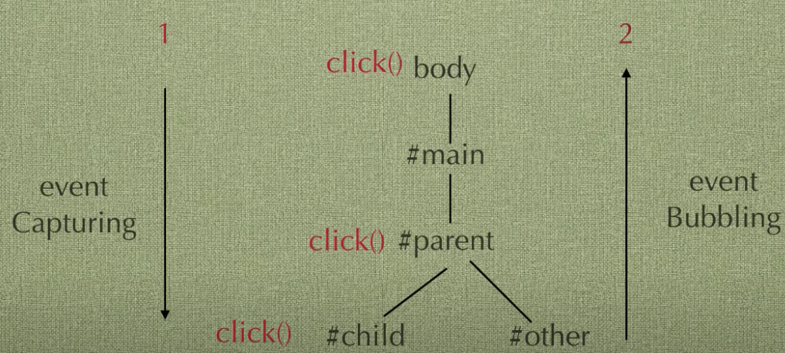

# What is Event Delegation

Event Delegation is a technique involving attaching event listeners to the parent instead of attaching to a child. It leverages the power of event-bubble-up mechanism.

There are some of the common JavaScript events:

-   change:: An HTML element has been changed
-   click:: The user clicks an HTML element
-   mouseover:: The user moves the mouse over an HTML element
-   mouseout:: The user moves the mouse away from an HTML element
-   keydown:: The user pushes a keyboard key
-   load:: The browser has finished loading the page

## Event Capturing vs Event Bubbling (Event Propagation)

Whenever a user clicks on a div, **Event Capturing** happens first, and then Event Bubbling


```js
<html>
	<head></head>
	<body>
		<h1> Event Bubbling Example</h1>
		<div id="Box">
			<div id="mid">
				<button id="myButton">Click Me!</button>
			</div>
		</div>
	</body>
</html>;

var parent = document.getElementById("Box");
parent.addEventListener(
	"click",
	function () {
		console.log("Box is clicked");
	},
	true // event capturing = true
);

var mid = document.getElementById("mid");
mid.addEventListener(
	"click",
	function () {
		console.log("mid is clicked");
	},
	true // event capturing = true
);

var child = document.getElementById("myButton");
child.addEventListener(
	"click",
	function () {
		console.log("Button is clicked");
	},
	true // event capturing = true
);

/* So in this case, the console prints:
Box is clicked
mid is clicked
Button is clicked
*/
```

In the phase of **Event Bubbling**, a click event ripples up all the way up to the top of the DOM and triggers clicks events on all the parent elements of the element you clicked


```js
<html>
	<head></head>
	<body>
		<h1> Event Bubbling Example</h1>
		<div id="Box">
			<div id="mid">
				<button id="myButton">Click Me!</button>
			</div>
		</div>
	</body>
</html>;

var parent = document.getElementById("Box");
parent.addEventListener("click", function () {
	console.log("Box is clicked");
});

var mid = document.getElementById("mid");
mid.addEventListener("click", function () {
	console.log("mid is clicked");
});

var child = document.getElementById("myButton");
child.addEventListener("click", function () {
	console.log("Button is clicked");
});

/* Since the 3rd argument is unset, the console prints:
Button is clicked
mid is clicked
Box is clicked
*/
```

And here is how the click event bubbling up


## So how to add event listener(s) to the buttons

```html
<table id="test">
	<tr>
		<td>List item1</td>
		<td><input type="button" value="edit" data-index="1" /></td>
	</tr>
	<tr>
		<td>List item2</td>
		<td><input type="button" value="edit" data-index="2" /></td>
	</tr>
	<tr>
		<td>List item3</td>
		<td><input type="button" value="edit" data-index="3" /></td>
	</tr>
	<tr>
		<td>List item4</td>
		<td><input type="button" value="edit" data-index="4" /></td>
	</tr>
	<tr>
		<td>List item5</td>
		<td><input type="button" value="edit" data-index="5" /></td>
	</tr>
	<tr>
		<td>List item6</td>
		<td><input type="button" value="edit" data-index="6" /></td>
	</tr>
	<tr>
		<td>List item7</td>
		<td><input type="button" value="edit" data-index="7" /></td>
	</tr>
</table>
<script type="text/javascript" src="//code.jquery.com/jquery-1.9.1.js"></script>

<script>
	$("#test [type=button]").on("click", function () {
		alert("hi, edit is fired on row " + $(this).data("index"));
	});
</script>
```

## Reference

<https://medium.com/@bretdoucette/part-4-what-is-event-delegation-in-javascript-f5c8c0de2983>
