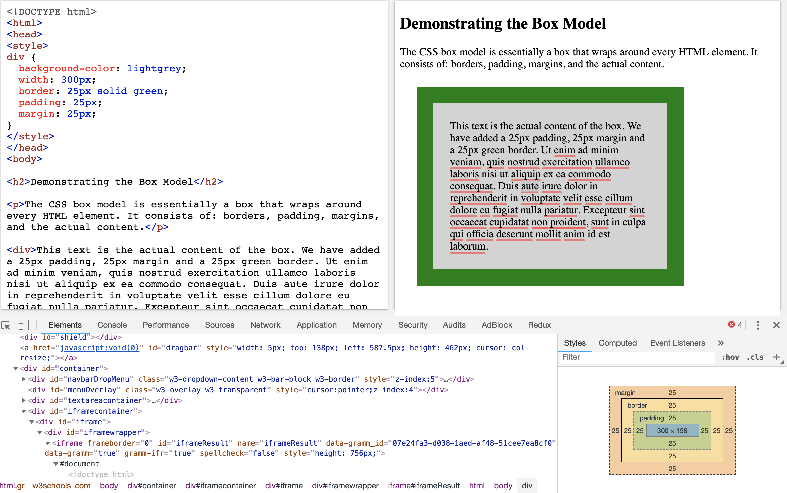

CSS Box Model
===

All HTML elements can be considered as boxes. In CSS, the term "box model" is used when talking about design and layout.

The CSS box model is essentially a box that wraps around every HTML element. It consists of: margins, borders, padding, and the actual content. The image below illustrates the box model:

- Content - The content of the box, where text and images appear
- Padding - Clears an area around the content. The padding is transparent
- Border - A border that goes around the padding and content
- Margin - Clears an area outside the border. The margin is transparent



Keep in mind that
---
When you set the width and height properties of an element with CSS, you just set the width and height of the content area. To calculate the full size of an element, you must also add padding, borders and margins.

For example,
```
div {
  width: 320px;
  padding: 10px;
  border: 5px solid gray;
  margin: 0; 
}
```

Calculate the width
```
320px (width)
+ 20px (left + right padding)
+ 10px (left + right border)
+ 0px (left + right margin)
= 350px
```