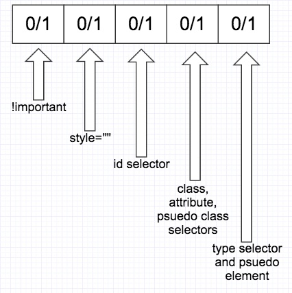

CSS Priority
===




Example1
---
```css
/* score: 00030 */
.a .b .c
{
    color: green;
}

/* score: 00020 */
.a .b
{
    color: red;
}
```
The result color of the `<div>` is green because the score is higher

Example2
---
```css
/*00020*/
.a .b
{
    color: red;
}

/*00010*/
.b
{
    /*now becomes 10010*/
    color: yellow !important;
}
```

Example3
---
```html
// supposed: green, result: green
<div class='.red .green'>Hello</div>

// supposed: red, result: green
<div class='.green .red'>Hello</div>
```
```css
.red
{
    color: red;
}

.green
{
    color: green;
}
```
The result of `<div class='.green .red'>Hello</div>` is GREEN, why?
- class attribute in your HTML doesn't care about order of classes
- BUT the order of declaration of your CSS classess in your CSS files

ref: 
https://teamtreehouse.com/community/priority-of-a-class-when-there-are-two-classes-in-the-same-element