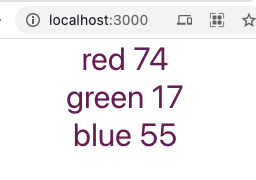

# Hello World to Server-Sent Events

Run the server

```
    cd ./server
    node server.js
```

Run the client

```
    cd ./client
    yarn start
```

Then you would see the RBG numbers and color of text being update for every 2 seconds



Don't forget to npm install in both folders
