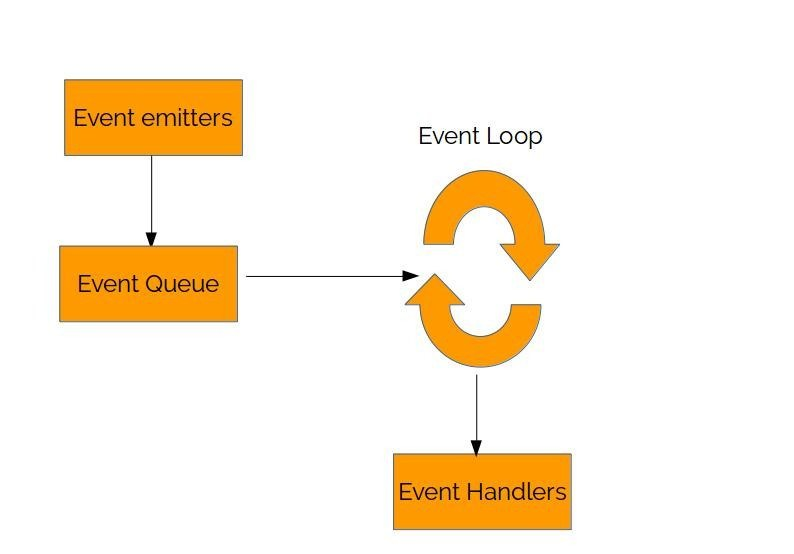

Event Loop
===
1 sentence
---
Basically, it helps NodeJS to run async actions given that NodeJS is single-thread

Detail
---
Node is single-threaded, it executes the code line by line, so how does it run async actions? 

**Event Loop** 

1. When the EventEmitter object emits an event, the events will be first enqueued into the event queue.
1. The event loop periodically checks if the queue has events, if yes then it dequeues the head event from the queue and calls the listeners. 
1. All of the functions attached to that specific event are called synchronously. 
1. Any values returned by the called listeners are ignored and will be discarded.
1. unlike callbacks/promise/aync&await, events are synchronous

Reference:
- [Video Explanation](https://www.youtube.com/watch?v=8aGhZQkoFbQ)